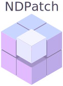

    
-----------

.. image:: https://travis-ci.org/ashkarin/ndpatch.svg?branch=master 
    :target: https://travis-ci.org/ashkarin/ndpatch

NDPatch is the package for extracting arbitrary regions from an N-dimensional numpy array assuming it mirrored infinitely.